# ShiftBox database entity relationship diagram

ShiftBox persists its application entities through Go's `database/sql` and versioned SQL migrations. These diagrams cover the application-owned schema through migration `00032` in this checkout. PostgreSQL stores application and Dex data in separately owned schemas. SQLite uses separate files for the two stores. Dex owns its own tables. [Database architecture](operations-state-and-recovery.md) · [PostgreSQL migrations](../../migrations/postgres/) · [SQLite migrations](../../migrations/sqlite/)

The diagrams show primary keys (PK), database foreign keys (FK), single-column unique keys (UK) on displayed fields, and selected domain fields. Multiple PK fields form a composite key. Solid lines indicate identifying relationships, where the foreign key is part of the child's primary key. Dashed lines indicate non-identifying foreign keys. Repeated tables connect the views, with only their primary key displayed outside their main view. Field types below use PostgreSQL names.

Crow’s-foot ends show cardinality. A double bar means exactly one, a circle and bar mean zero or one, and a circle and fork mean zero or many. Each view focuses on one part of the schema. Referenced tables repeat with their primary keys so every relationship can be read locally. Many-to-many associations use join tables, including `notice_receipts` and `maintenance_targets`.

Open the SVG previews at full size to inspect keys and cardinalities. Each view includes a portable Mermaid version and a styled version for GitHub, Mermaid Live, or a VS Code Mermaid preview. The styled version customizes marker geometry, while the SVG preserves the reviewed appearance.

## Database overview

All 45 application tables appear once, with all 55 declared foreign keys. Tables show primary keys, with foreign-key columns on connector labels. Template grants show their foreign-key fields because the table uses a partial unique index for active grants. Tables without a declared foreign key appear as standalone entities. Application-managed references are described at the end of this document.

[Open the full-size overview SVG](diagrams/database-overview.svg) to zoom into the landscape diagram. Dense areas contain crossing connectors. Use the focused views below to follow individual relationships.



Portable Mermaid source

```mermaid
erDiagram
    %% All 45 application tables and 55 database foreign keys through migration 00032. Tables show their primary keys. Connector labels identify the child foreign-key columns.
    accTitle: ShiftBox database overview
    accDescr: All 45 application tables and 55 database foreign keys through migration 00032. Tables show their primary keys. Connector labels identify the child foreign-key columns.
    direction TB
    activated_configurations {
        text installation_id PK,FK
        bigint generation PK
    }
    activity_observations {
        text workspace_id PK,FK
        bigint generation PK
        text source PK
    }
    audit_events {
        bigserial id PK
    }
    backup_records {
        text id PK
    }
    bootstrap_administrator {
        text installation_id PK,FK
    }
    browser_certificates {
        text id PK
    }
    capacity_budgets {
        text installation_id PK,FK
    }
    ec2_launch_challenges {
        text nonce PK
    }
    ec2_launch_enrollment {
        text operation_id PK,FK
    }
    enrollment_grants {
        text id PK
    }
    external_connector {
        text installation_id PK,FK
    }
    github_authorizations {
        text user_id PK,FK
        text app_id PK
    }
    github_oauth_states {
        text user_id PK,FK
        text app_id PK
    }
    guest_dispatches {
        text operation_id PK,FK
    }
    guest_registrations {
        text workspace_id PK,FK
        bigint generation PK
    }
    identity_bindings {
        text id PK
    }
    installations {
        text id PK
    }
    local_user_creations {
        text email PK
    }
    maintenance_campaigns {
        text operation_id PK,FK
    }
    maintenance_targets {
        text campaign_id PK,FK
        text workspace_id PK,FK
    }
    migration_preflights {
        text operation_id PK,FK
    }
    network_policies {
        text id PK
    }
    notice_receipts {
        text notice_id PK,FK
        text user_id PK,FK
    }
    notices {
        text id PK
    }
    operation_events {
        text operation_id PK,FK
        bigint event_id PK
    }
    operation_steps {
        text operation_id PK,FK
        integer step_index PK
    }
    operational_conditions {
        text condition_key PK
    }
    operations {
        text id PK
    }
    origin_grants {
        text id PK
    }
    platform_artifacts {
        text id PK
    }
    platform_imports {
        text operation_id PK,FK
    }
    project_templates {
        text id PK,FK
    }
    protected_values {
        text id PK
    }
    provider_resources {
        text workspace_id PK,FK
        text provider_resource_id PK
    }
    recovery_reviews {
        text id PK
    }
    reservations {
        text workspace_id PK,FK
    }
    resource_grants {
        text id PK
    }
    resource_profiles {
        text id PK
    }
    secret_values {
        text id PK
    }
    sessions {
        text id PK
    }
    template_grants {
        text template_id FK
        text user_id FK
        text granted_by FK
    }
    template_requests {
        text actor_id PK,FK
        text request_key PK
    }
    template_revisions {
        text template_id PK,FK
        bigint revision PK
    }
    users {
        text id PK
    }
    workspaces {
        text id PK
    }

    installations ||--o{ activated_configurations : "installation_id"
    installations ||--o| bootstrap_administrator : "installation_id"
    users ||..o| bootstrap_administrator : "user_id"
    operations |o..o| bootstrap_administrator : "operation_id"
    protected_values |o..o| bootstrap_administrator : "password_ciphertext_id"
    installations ||--o| external_connector : "installation_id"
    users ||..o{ identity_bindings : "user_id"
    users ||..o{ sessions : "user_id"
    users ||..o{ resource_grants : "subject_user_id"
    users ||..o{ resource_grants : "granted_by"
    users ||--o{ github_authorizations : "user_id"
    users ||--o{ github_oauth_states : "user_id"
    protected_values ||..o{ browser_certificates : "private_key_ciphertext_id"
    users ||..o{ secret_values : "created_by"
    notices ||--o{ notice_receipts : "notice_id"
    users ||--o{ notice_receipts : "user_id"
    users ||..o{ notices : "created_by"
    platform_artifacts ||..o{ template_revisions : "platform_artifact_id"
    project_templates ||--o{ template_revisions : "template_id"
    resource_profiles ||..o{ template_revisions : "resource_profile_id"
    template_revisions ||..o| project_templates : "current revision"
    users ||..o{ project_templates : "owner_user_id"
    users ||..o{ template_revisions : "created_by"
    project_templates ||..o{ template_grants : "template_id"
    users ||..o{ template_grants : "user_id"
    users ||..o{ template_grants : "granted_by"
    users ||--o{ template_requests : "actor_id"
    installations ||..o{ platform_imports : "installation_id"
    installations ||--o| capacity_budgets : "installation_id"
    operations ||--o| platform_imports : "operation_id"
    users ||..o{ platform_artifacts : "imported_by"
    installations ||..o{ workspaces : "installation_id"
    platform_artifacts ||..o{ workspaces : "platform_artifact_id"
    users ||..o{ workspaces : "owner_user_id"
    workspaces ||--o| reservations : "workspace_id"
    workspaces ||--o{ provider_resources : "workspace_id"
    workspaces ||--o{ activity_observations : "workspace_id"
    operations ||--o{ operation_steps : "operation_id"
    operations ||--o{ operation_events : "operation_id"
    operations ||--o| guest_dispatches : "operation_id"
    workspaces ||--o{ guest_registrations : "workspace_id"
    operations ||..o{ enrollment_grants : "operation_id"
    guest_registrations ||..o{ enrollment_grants : "workspace_id + generation"
    operations ||--o| ec2_launch_enrollment : "operation_id"
    ec2_launch_enrollment ||..o{ ec2_launch_challenges : "operation_id"
    users ||..o{ maintenance_campaigns : "created_by"
    operations ||--o| maintenance_campaigns : "operation_id"
    installations ||..o{ maintenance_campaigns : "installation_id"
    workspaces ||--o{ maintenance_targets : "workspace_id"
    operations |o..o| maintenance_targets : "operation_id"
    maintenance_campaigns ||--o{ maintenance_targets : "campaign_id"
    operations ||..o| backup_records : "operation_id"
    operations ||--o| migration_preflights : "operation_id"
    installations ||..o{ migration_preflights : "installation_id"
    operations ||..o| recovery_reviews : "restore_operation_id"
```

Styled Mermaid source

```mermaid
---
config:
  theme: base
  htmlLabels: false
  fontFamily: "Arial, Helvetica, sans-serif"
  er:
    entityPadding: 6
    nodeSpacing: 80
    rankSpacing: 130
    useMaxWidth: false
  themeVariables:
    background: "#FFFFFF"
    mainBkg: "#3522B8"
    rowOdd: "#F7F8FC"
    rowEven: "#F7F8FC"
    nodeBorder: "#5E697A"
    nodeTextColor: "#191821"
    textColor: "#191821"
    lineColor: "#465366"
  themeCSS: |
    & {
      background-color: #FFFFFF;
    }
    .node .label.name text,
    .node .label.name tspan {
      fill: #FFFFFF;
      font-weight: 700;
    }
    .node .label[class*="attribute-"] text {
      fill: #191821;
    }
    .edgeLabel foreignObject .labelBkg {
      background: #FFFFFF !important;
      border-radius: 3px;
      box-shadow: 0 0 0 2px #FFFFFF;
      padding-inline: 3px;
    }
    .edgeLabel foreignObject .edgeLabel,
    .edgeLabel foreignObject p {
      background: transparent !important;
      color: #191821 !important;
    }
    .edgeLabel foreignObject p {
      font-weight: 600;
    }
    .edgeLabel text,
    .edgeLabel tspan {
      fill: #191821 !important;
      stroke: #FFFFFF;
      stroke-width: 3px;
      paint-order: stroke fill;
    }
    .relationshipLine {
      stroke-width: 1px;
    }
    .marker path, .marker circle {
      stroke: #465366 !important;
      stroke-width: 1.4px !important;
    }
    .marker circle {
      fill: #FFFFFF !important;
    }
    marker[id$="zeroOrMoreStart"] path {
      d: path("M36,9 L18,18 L36,27 M18,18 L36,18");
    }
    marker[id$="zeroOrMoreEnd"] path {
      d: path("M21,9 L39,18 L21,27 M21,18 L39,18");
    }
---
erDiagram
    %% All 45 application tables and 55 database foreign keys through migration 00032. Tables show their primary keys. Connector labels identify the child foreign-key columns.
    accTitle: ShiftBox database overview
    accDescr: All 45 application tables and 55 database foreign keys through migration 00032. Tables show their primary keys. Connector labels identify the child foreign-key columns.
    direction TB
    activated_configurations {
        text installation_id PK,FK
        bigint generation PK
    }
    activity_observations {
        text workspace_id PK,FK
        bigint generation PK
        text source PK
    }
    audit_events {
        bigserial id PK
    }
    backup_records {
        text id PK
    }
    bootstrap_administrator {
        text installation_id PK,FK
    }
    browser_certificates {
        text id PK
    }
    capacity_budgets {
        text installation_id PK,FK
    }
    ec2_launch_challenges {
        text nonce PK
    }
    ec2_launch_enrollment {
        text operation_id PK,FK
    }
    enrollment_grants {
        text id PK
    }
    external_connector {
        text installation_id PK,FK
    }
    github_authorizations {
        text user_id PK,FK
        text app_id PK
    }
    github_oauth_states {
        text user_id PK,FK
        text app_id PK
    }
    guest_dispatches {
        text operation_id PK,FK
    }
    guest_registrations {
        text workspace_id PK,FK
        bigint generation PK
    }
    identity_bindings {
        text id PK
    }
    installations {
        text id PK
    }
    local_user_creations {
        text email PK
    }
    maintenance_campaigns {
        text operation_id PK,FK
    }
    maintenance_targets {
        text campaign_id PK,FK
        text workspace_id PK,FK
    }
    migration_preflights {
        text operation_id PK,FK
    }
    network_policies {
        text id PK
    }
    notice_receipts {
        text notice_id PK,FK
        text user_id PK,FK
    }
    notices {
        text id PK
    }
    operation_events {
        text operation_id PK,FK
        bigint event_id PK
    }
    operation_steps {
        text operation_id PK,FK
        integer step_index PK
    }
    operational_conditions {
        text condition_key PK
    }
    operations {
        text id PK
    }
    origin_grants {
        text id PK
    }
    platform_artifacts {
        text id PK
    }
    platform_imports {
        text operation_id PK,FK
    }
    project_templates {
        text id PK,FK
    }
    protected_values {
        text id PK
    }
    provider_resources {
        text workspace_id PK,FK
        text provider_resource_id PK
    }
    recovery_reviews {
        text id PK
    }
    reservations {
        text workspace_id PK,FK
    }
    resource_grants {
        text id PK
    }
    resource_profiles {
        text id PK
    }
    secret_values {
        text id PK
    }
    sessions {
        text id PK
    }
    template_grants {
        text template_id FK
        text user_id FK
        text granted_by FK
    }
    template_requests {
        text actor_id PK,FK
        text request_key PK
    }
    template_revisions {
        text template_id PK,FK
        bigint revision PK
    }
    users {
        text id PK
    }
    workspaces {
        text id PK
    }

    installations ||--o{ activated_configurations : "installation_id"
    installations ||--o| bootstrap_administrator : "installation_id"
    users ||..o| bootstrap_administrator : "user_id"
    operations |o..o| bootstrap_administrator : "operation_id"
    protected_values |o..o| bootstrap_administrator : "password_ciphertext_id"
    installations ||--o| external_connector : "installation_id"
    users ||..o{ identity_bindings : "user_id"
    users ||..o{ sessions : "user_id"
    users ||..o{ resource_grants : "subject_user_id"
    users ||..o{ resource_grants : "granted_by"
    users ||--o{ github_authorizations : "user_id"
    users ||--o{ github_oauth_states : "user_id"
    protected_values ||..o{ browser_certificates : "private_key_ciphertext_id"
    users ||..o{ secret_values : "created_by"
    notices ||--o{ notice_receipts : "notice_id"
    users ||--o{ notice_receipts : "user_id"
    users ||..o{ notices : "created_by"
    platform_artifacts ||..o{ template_revisions : "platform_artifact_id"
    project_templates ||--o{ template_revisions : "template_id"
    resource_profiles ||..o{ template_revisions : "resource_profile_id"
    template_revisions ||..o| project_templates : "current revision"
    users ||..o{ project_templates : "owner_user_id"
    users ||..o{ template_revisions : "created_by"
    project_templates ||..o{ template_grants : "template_id"
    users ||..o{ template_grants : "user_id"
    users ||..o{ template_grants : "granted_by"
    users ||--o{ template_requests : "actor_id"
    installations ||..o{ platform_imports : "installation_id"
    installations ||--o| capacity_budgets : "installation_id"
    operations ||--o| platform_imports : "operation_id"
    users ||..o{ platform_artifacts : "imported_by"
    installations ||..o{ workspaces : "installation_id"
    platform_artifacts ||..o{ workspaces : "platform_artifact_id"
    users ||..o{ workspaces : "owner_user_id"
    workspaces ||--o| reservations : "workspace_id"
    workspaces ||--o{ provider_resources : "workspace_id"
    workspaces ||--o{ activity_observations : "workspace_id"
    operations ||--o{ operation_steps : "operation_id"
    operations ||--o{ operation_events : "operation_id"
    operations ||--o| guest_dispatches : "operation_id"
    workspaces ||--o{ guest_registrations : "workspace_id"
    operations ||..o{ enrollment_grants : "operation_id"
    guest_registrations ||..o{ enrollment_grants : "workspace_id + generation"
    operations ||--o| ec2_launch_enrollment : "operation_id"
    ec2_launch_enrollment ||..o{ ec2_launch_challenges : "operation_id"
    users ||..o{ maintenance_campaigns : "created_by"
    operations ||--o| maintenance_campaigns : "operation_id"
    installations ||..o{ maintenance_campaigns : "installation_id"
    workspaces ||--o{ maintenance_targets : "workspace_id"
    operations |o..o| maintenance_targets : "operation_id"
    maintenance_campaigns ||--o{ maintenance_targets : "campaign_id"
    operations ||..o| backup_records : "operation_id"
    operations ||--o| migration_preflights : "operation_id"
    installations ||..o{ migration_preflights : "installation_id"
    operations ||..o| recovery_reviews : "restore_operation_id"
```

## Installation and bootstrap

Installation configuration and the initial administrator link to protected setup credentials and operations.



Portable Mermaid source

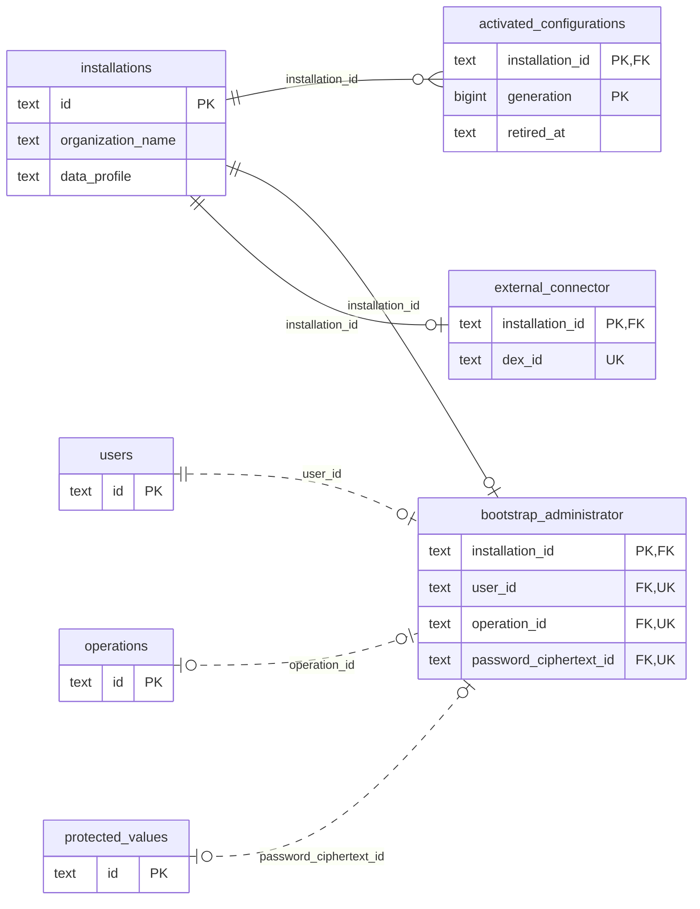
```mermaid
%% Installation configuration and the initial administrator link to protected setup credentials and operations.
erDiagram
    %% Installation configuration and the initial administrator link to protected setup credentials and operations.
    accTitle: Installation and bootstrap
    accDescr: Installation configuration and the initial administrator link to protected setup credentials and operations.
    direction LR
    activated_configurations {
        text installation_id PK,FK
        bigint generation PK
        text retired_at
    }
    bootstrap_administrator {
        text installation_id PK,FK
        text user_id FK,UK
        text operation_id FK,UK
        text password_ciphertext_id FK,UK
    }
    external_connector {
        text installation_id PK,FK
        text dex_id UK
    }
    installations {
        text id PK
        text organization_name
        text data_profile
    }
    operations {
        text id PK
    }
    protected_values {
        text id PK
    }
    users {
        text id PK
    }

    installations ||--o{ activated_configurations : "installation_id"
    installations ||--o| bootstrap_administrator : "installation_id"
    users ||..o| bootstrap_administrator : "user_id"
    operations |o..o| bootstrap_administrator : "operation_id"
    protected_values |o..o| bootstrap_administrator : "password_ciphertext_id"
    installations ||--o| external_connector : "installation_id"
```

Styled Mermaid source

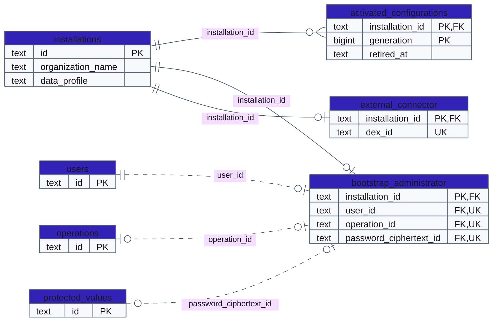
```mermaid
---
config:
  theme: base
  htmlLabels: false
  fontFamily: "Arial, Helvetica, sans-serif"
  er:
    entityPadding: 6
    nodeSpacing: 65
    rankSpacing: 110
    useMaxWidth: false
  themeVariables:
    background: "#FFFFFF"
    mainBkg: "#3522B8"
    rowOdd: "#F7F8FC"
    rowEven: "#F7F8FC"
    nodeBorder: "#5E697A"
    nodeTextColor: "#191821"
    textColor: "#191821"
    lineColor: "#465366"
  themeCSS: |
    & {
      background-color: #FFFFFF;
    }
    .node .label.name text,
    .node .label.name tspan {
      fill: #FFFFFF;
      font-weight: 700;
    }
    .node .label[class*="attribute-"] text {
      fill: #191821;
    }
    .edgeLabel foreignObject .labelBkg {
      background: #FFFFFF !important;
      border-radius: 3px;
      box-shadow: 0 0 0 2px #FFFFFF;
      padding-inline: 3px;
    }
    .edgeLabel foreignObject .edgeLabel,
    .edgeLabel foreignObject p {
      background: transparent !important;
      color: #191821 !important;
    }
    .edgeLabel foreignObject p {
      font-weight: 600;
    }
    .edgeLabel text,
    .edgeLabel tspan {
      fill: #191821 !important;
      stroke: #FFFFFF;
      stroke-width: 3px;
      paint-order: stroke fill;
    }
    .relationshipLine {
      stroke-width: 1px;
    }
    .marker path, .marker circle {
      stroke: #465366 !important;
      stroke-width: 1.4px !important;
    }
    .marker circle {
      fill: #FFFFFF !important;
    }
    marker[id$="zeroOrMoreStart"] path {
      d: path("M36,9 L18,18 L36,27 M18,18 L36,18");
    }
    marker[id$="zeroOrMoreEnd"] path {
      d: path("M21,9 L39,18 L21,27 M21,18 L39,18");
    }
---
erDiagram
    %% Installation configuration and the initial administrator link to protected setup credentials and operations.
    accTitle: Installation and bootstrap
    accDescr: Installation configuration and the initial administrator link to protected setup credentials and operations.
    direction LR
    activated_configurations {
        text installation_id PK,FK
        bigint generation PK
        text retired_at
    }
    bootstrap_administrator {
        text installation_id PK,FK
        text user_id FK,UK
        text operation_id FK,UK
        text password_ciphertext_id FK,UK
    }
    external_connector {
        text installation_id PK,FK
        text dex_id UK
    }
    installations {
        text id PK
        text organization_name
        text data_profile
    }
    operations {
        text id PK
    }
    protected_values {
        text id PK
    }
    users {
        text id PK
    }

    installations ||--o{ activated_configurations : "installation_id"
    installations ||--o| bootstrap_administrator : "installation_id"
    users ||..o| bootstrap_administrator : "user_id"
    operations |o..o| bootstrap_administrator : "operation_id"
    protected_values |o..o| bootstrap_administrator : "password_ciphertext_id"
    installations ||--o| external_connector : "installation_id"
```

## Identity and sessions

Identity bindings and browser sessions belong to users. Local account creation retains a separate retry record.



Portable Mermaid source

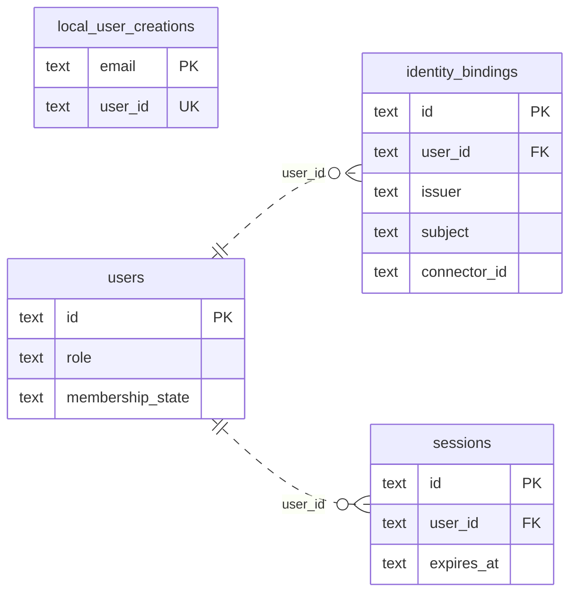
```mermaid
%% Identity bindings and browser sessions belong to users. Local account creation retains a separate retry record.
erDiagram
    %% Identity bindings and browser sessions belong to users. Local account creation retains a separate retry record.
    accTitle: Identity and sessions
    accDescr: Identity bindings and browser sessions belong to users. Local account creation retains a separate retry record.
    direction LR
    identity_bindings {
        text id PK
        text user_id FK
        text issuer
        text subject
        text connector_id
    }
    local_user_creations {
        text email PK
        text user_id UK
    }
    sessions {
        text id PK
        text user_id FK
        text expires_at
    }
    users {
        text id PK
        text role
        text membership_state
    }

    users ||..o{ identity_bindings : "user_id"
    users ||..o{ sessions : "user_id"
```

Styled Mermaid source

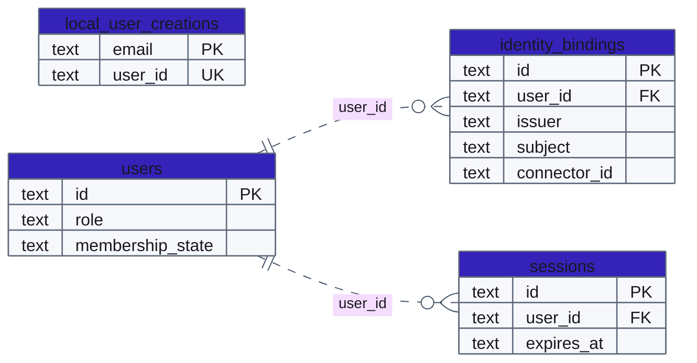
```mermaid
---
config:
  theme: base
  htmlLabels: false
  fontFamily: "Arial, Helvetica, sans-serif"
  er:
    entityPadding: 6
    nodeSpacing: 65
    rankSpacing: 110
    useMaxWidth: false
  themeVariables:
    background: "#FFFFFF"
    mainBkg: "#3522B8"
    rowOdd: "#F7F8FC"
    rowEven: "#F7F8FC"
    nodeBorder: "#5E697A"
    nodeTextColor: "#191821"
    textColor: "#191821"
    lineColor: "#465366"
  themeCSS: |
    & {
      background-color: #FFFFFF;
    }
    .node .label.name text,
    .node .label.name tspan {
      fill: #FFFFFF;
      font-weight: 700;
    }
    .node .label[class*="attribute-"] text {
      fill: #191821;
    }
    .edgeLabel foreignObject .labelBkg {
      background: #FFFFFF !important;
      border-radius: 3px;
      box-shadow: 0 0 0 2px #FFFFFF;
      padding-inline: 3px;
    }
    .edgeLabel foreignObject .edgeLabel,
    .edgeLabel foreignObject p {
      background: transparent !important;
      color: #191821 !important;
    }
    .edgeLabel foreignObject p {
      font-weight: 600;
    }
    .edgeLabel text,
    .edgeLabel tspan {
      fill: #191821 !important;
      stroke: #FFFFFF;
      stroke-width: 3px;
      paint-order: stroke fill;
    }
    .relationshipLine {
      stroke-width: 1px;
    }
    .marker path, .marker circle {
      stroke: #465366 !important;
      stroke-width: 1.4px !important;
    }
    .marker circle {
      fill: #FFFFFF !important;
    }
    marker[id$="zeroOrMoreStart"] path {
      d: path("M36,9 L18,18 L36,27 M18,18 L36,18");
    }
    marker[id$="zeroOrMoreEnd"] path {
      d: path("M21,9 L39,18 L21,27 M21,18 L39,18");
    }
---
erDiagram
    %% Identity bindings and browser sessions belong to users. Local account creation retains a separate retry record.
    accTitle: Identity and sessions
    accDescr: Identity bindings and browser sessions belong to users. Local account creation retains a separate retry record.
    direction LR
    identity_bindings {
        text id PK
        text user_id FK
        text issuer
        text subject
        text connector_id
    }
    local_user_creations {
        text email PK
        text user_id UK
    }
    sessions {
        text id PK
        text user_id FK
        text expires_at
    }
    users {
        text id PK
        text role
        text membership_state
    }

    users ||..o{ identity_bindings : "user_id"
    users ||..o{ sessions : "user_id"
```

## Access grants

Resource grants record both the recipient and granting user. Origin grants retain application-managed session and workspace references.



Portable Mermaid source

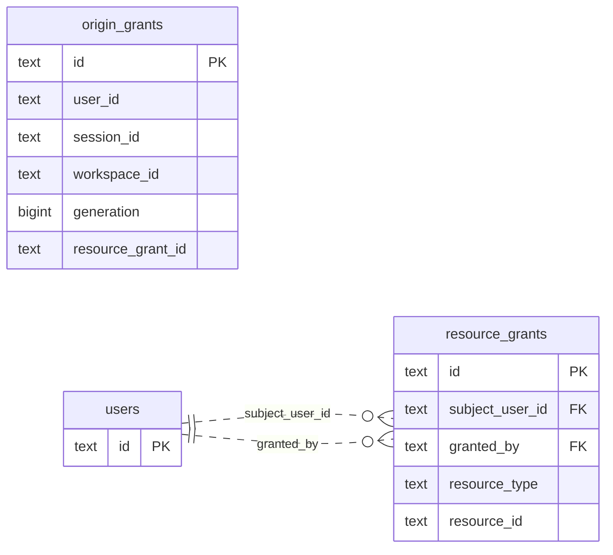
```mermaid
%% Resource grants record both the recipient and granting user. Origin grants retain application-managed session and workspace references.
erDiagram
    %% Resource grants record both the recipient and granting user. Origin grants retain application-managed session and workspace references.
    accTitle: Access grants
    accDescr: Resource grants record both the recipient and granting user. Origin grants retain application-managed session and workspace references.
    direction LR
    origin_grants {
        text id PK
        text user_id
        text session_id
        text workspace_id
        bigint generation
        text resource_grant_id
    }
    resource_grants {
        text id PK
        text subject_user_id FK
        text granted_by FK
        text resource_type
        text resource_id
    }
    users {
        text id PK
    }

    users ||..o{ resource_grants : "subject_user_id"
    users ||..o{ resource_grants : "granted_by"
```

Styled Mermaid source

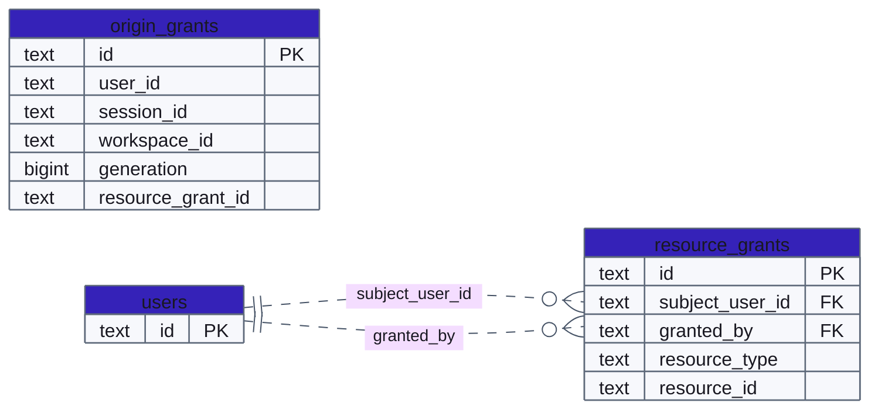
```mermaid
---
config:
  theme: base
  htmlLabels: false
  fontFamily: "Arial, Helvetica, sans-serif"
  er:
    entityPadding: 6
    nodeSpacing: 65
    rankSpacing: 110
    useMaxWidth: false
  themeVariables:
    background: "#FFFFFF"
    mainBkg: "#3522B8"
    rowOdd: "#F7F8FC"
    rowEven: "#F7F8FC"
    nodeBorder: "#5E697A"
    nodeTextColor: "#191821"
    textColor: "#191821"
    lineColor: "#465366"
  themeCSS: |
    & {
      background-color: #FFFFFF;
    }
    .node .label.name text,
    .node .label.name tspan {
      fill: #FFFFFF;
      font-weight: 700;
    }
    .node .label[class*="attribute-"] text {
      fill: #191821;
    }
    .edgeLabel foreignObject .labelBkg {
      background: #FFFFFF !important;
      border-radius: 3px;
      box-shadow: 0 0 0 2px #FFFFFF;
      padding-inline: 3px;
    }
    .edgeLabel foreignObject .edgeLabel,
    .edgeLabel foreignObject p {
      background: transparent !important;
      color: #191821 !important;
    }
    .edgeLabel foreignObject p {
      font-weight: 600;
    }
    .edgeLabel text,
    .edgeLabel tspan {
      fill: #191821 !important;
      stroke: #FFFFFF;
      stroke-width: 3px;
      paint-order: stroke fill;
    }
    .relationshipLine {
      stroke-width: 1px;
    }
    .marker path, .marker circle {
      stroke: #465366 !important;
      stroke-width: 1.4px !important;
    }
    .marker circle {
      fill: #FFFFFF !important;
    }
    marker[id$="zeroOrMoreStart"] path {
      d: path("M36,9 L18,18 L36,27 M18,18 L36,18");
    }
    marker[id$="zeroOrMoreEnd"] path {
      d: path("M21,9 L39,18 L21,27 M21,18 L39,18");
    }
---
erDiagram
    %% Resource grants record both the recipient and granting user. Origin grants retain application-managed session and workspace references.
    accTitle: Access grants
    accDescr: Resource grants record both the recipient and granting user. Origin grants retain application-managed session and workspace references.
    direction LR
    origin_grants {
        text id PK
        text user_id
        text session_id
        text workspace_id
        bigint generation
        text resource_grant_id
    }
    resource_grants {
        text id PK
        text subject_user_id FK
        text granted_by FK
        text resource_type
        text resource_id
    }
    users {
        text id PK
    }

    users ||..o{ resource_grants : "subject_user_id"
    users ||..o{ resource_grants : "granted_by"
```

## GitHub authorization

Each user can hold authorization and OAuth state per GitHub App.



Portable Mermaid source

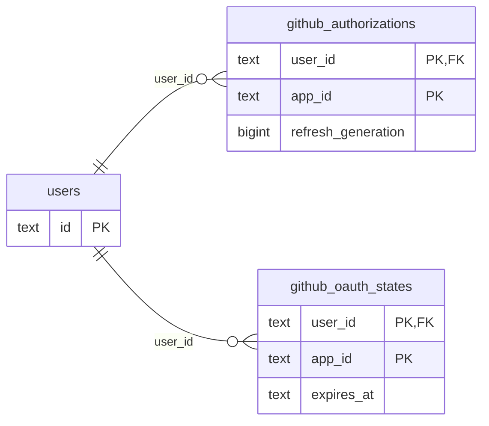
```mermaid
%% Each user can hold authorization and OAuth state per GitHub App.
erDiagram
    %% Each user can hold authorization and OAuth state per GitHub App.
    accTitle: GitHub authorization
    accDescr: Each user can hold authorization and OAuth state per GitHub App.
    direction LR
    github_authorizations {
        text user_id PK,FK
        text app_id PK
        bigint refresh_generation
    }
    github_oauth_states {
        text user_id PK,FK
        text app_id PK
        text expires_at
    }
    users {
        text id PK
    }

    users ||--o{ github_authorizations : "user_id"
    users ||--o{ github_oauth_states : "user_id"
```

Styled Mermaid source

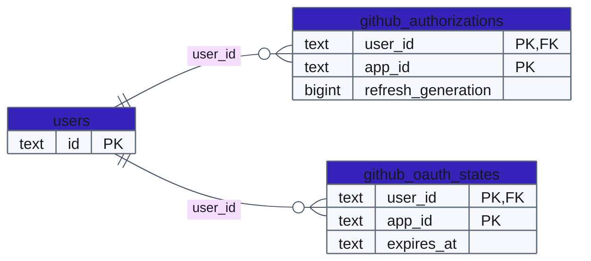
```mermaid
---
config:
  theme: base
  htmlLabels: false
  fontFamily: "Arial, Helvetica, sans-serif"
  er:
    entityPadding: 6
    nodeSpacing: 65
    rankSpacing: 110
    useMaxWidth: false
  themeVariables:
    background: "#FFFFFF"
    mainBkg: "#3522B8"
    rowOdd: "#F7F8FC"
    rowEven: "#F7F8FC"
    nodeBorder: "#5E697A"
    nodeTextColor: "#191821"
    textColor: "#191821"
    lineColor: "#465366"
  themeCSS: |
    & {
      background-color: #FFFFFF;
    }
    .node .label.name text,
    .node .label.name tspan {
      fill: #FFFFFF;
      font-weight: 700;
    }
    .node .label[class*="attribute-"] text {
      fill: #191821;
    }
    .edgeLabel foreignObject .labelBkg {
      background: #FFFFFF !important;
      border-radius: 3px;
      box-shadow: 0 0 0 2px #FFFFFF;
      padding-inline: 3px;
    }
    .edgeLabel foreignObject .edgeLabel,
    .edgeLabel foreignObject p {
      background: transparent !important;
      color: #191821 !important;
    }
    .edgeLabel foreignObject p {
      font-weight: 600;
    }
    .edgeLabel text,
    .edgeLabel tspan {
      fill: #191821 !important;
      stroke: #FFFFFF;
      stroke-width: 3px;
      paint-order: stroke fill;
    }
    .relationshipLine {
      stroke-width: 1px;
    }
    .marker path, .marker circle {
      stroke: #465366 !important;
      stroke-width: 1.4px !important;
    }
    .marker circle {
      fill: #FFFFFF !important;
    }
    marker[id$="zeroOrMoreStart"] path {
      d: path("M36,9 L18,18 L36,27 M18,18 L36,18");
    }
    marker[id$="zeroOrMoreEnd"] path {
      d: path("M21,9 L39,18 L21,27 M21,18 L39,18");
    }
---
erDiagram
    %% Each user can hold authorization and OAuth state per GitHub App.
    accTitle: GitHub authorization
    accDescr: Each user can hold authorization and OAuth state per GitHub App.
    direction LR
    github_authorizations {
        text user_id PK,FK
        text app_id PK
        bigint refresh_generation
    }
    github_oauth_states {
        text user_id PK,FK
        text app_id PK
        text expires_at
    }
    users {
        text id PK
    }

    users ||--o{ github_authorizations : "user_id"
    users ||--o{ github_oauth_states : "user_id"
```

## Certificates and secrets

Browser certificates reference protected private keys. Secret records retain their creator and scoped encrypted values.



Portable Mermaid source

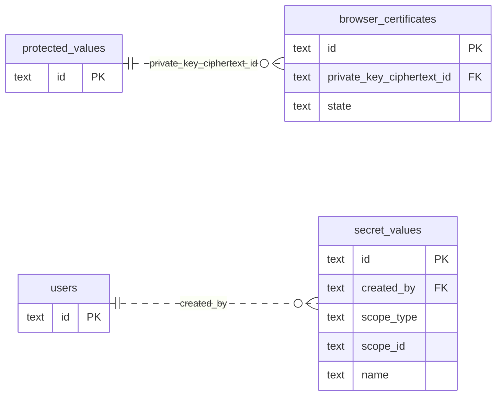
```mermaid
%% Browser certificates reference protected private keys. Secret records retain their creator and scoped encrypted values.
erDiagram
    %% Browser certificates reference protected private keys. Secret records retain their creator and scoped encrypted values.
    accTitle: Certificates and secrets
    accDescr: Browser certificates reference protected private keys. Secret records retain their creator and scoped encrypted values.
    direction LR
    browser_certificates {
        text id PK
        text private_key_ciphertext_id FK
        text state
    }
    protected_values {
        text id PK
    }
    secret_values {
        text id PK
        text created_by FK
        text scope_type
        text scope_id
        text name
    }
    users {
        text id PK
    }

    protected_values ||..o{ browser_certificates : "private_key_ciphertext_id"
    users ||..o{ secret_values : "created_by"
```

Styled Mermaid source

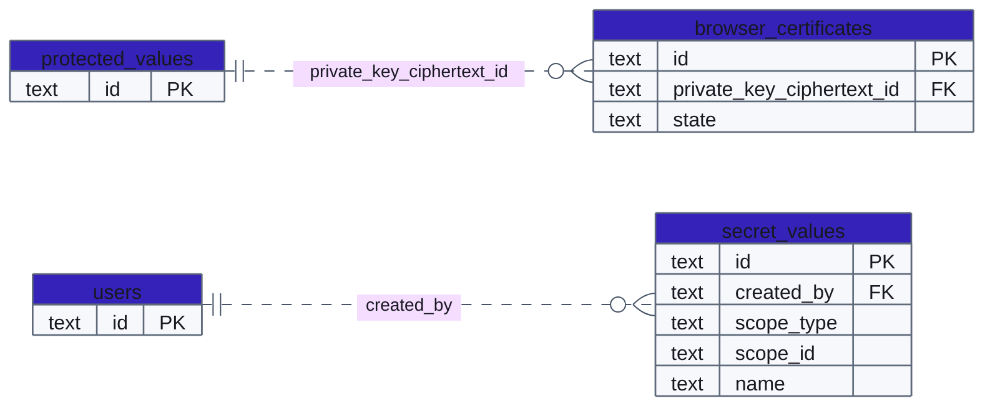
```mermaid
---
config:
  theme: base
  htmlLabels: false
  fontFamily: "Arial, Helvetica, sans-serif"
  er:
    entityPadding: 6
    nodeSpacing: 65
    rankSpacing: 110
    useMaxWidth: false
  themeVariables:
    background: "#FFFFFF"
    mainBkg: "#3522B8"
    rowOdd: "#F7F8FC"
    rowEven: "#F7F8FC"
    nodeBorder: "#5E697A"
    nodeTextColor: "#191821"
    textColor: "#191821"
    lineColor: "#465366"
  themeCSS: |
    & {
      background-color: #FFFFFF;
    }
    .node .label.name text,
    .node .label.name tspan {
      fill: #FFFFFF;
      font-weight: 700;
    }
    .node .label[class*="attribute-"] text {
      fill: #191821;
    }
    .edgeLabel foreignObject .labelBkg {
      background: #FFFFFF !important;
      border-radius: 3px;
      box-shadow: 0 0 0 2px #FFFFFF;
      padding-inline: 3px;
    }
    .edgeLabel foreignObject .edgeLabel,
    .edgeLabel foreignObject p {
      background: transparent !important;
      color: #191821 !important;
    }
    .edgeLabel foreignObject p {
      font-weight: 600;
    }
    .edgeLabel text,
    .edgeLabel tspan {
      fill: #191821 !important;
      stroke: #FFFFFF;
      stroke-width: 3px;
      paint-order: stroke fill;
    }
    .relationshipLine {
      stroke-width: 1px;
    }
    .marker path, .marker circle {
      stroke: #465366 !important;
      stroke-width: 1.4px !important;
    }
    .marker circle {
      fill: #FFFFFF !important;
    }
    marker[id$="zeroOrMoreStart"] path {
      d: path("M36,9 L18,18 L36,27 M18,18 L36,18");
    }
    marker[id$="zeroOrMoreEnd"] path {
      d: path("M21,9 L39,18 L21,27 M21,18 L39,18");
    }
---
erDiagram
    %% Browser certificates reference protected private keys. Secret records retain their creator and scoped encrypted values.
    accTitle: Certificates and secrets
    accDescr: Browser certificates reference protected private keys. Secret records retain their creator and scoped encrypted values.
    direction LR
    browser_certificates {
        text id PK
        text private_key_ciphertext_id FK
        text state
    }
    protected_values {
        text id PK
    }
    secret_values {
        text id PK
        text created_by FK
        text scope_type
        text scope_id
        text name
    }
    users {
        text id PK
    }

    protected_values ||..o{ browser_certificates : "private_key_ciphertext_id"
    users ||..o{ secret_values : "created_by"
```

## Notices and receipts

Receipts join notices to users, recording the many-to-many delivery relationship.



Portable Mermaid source

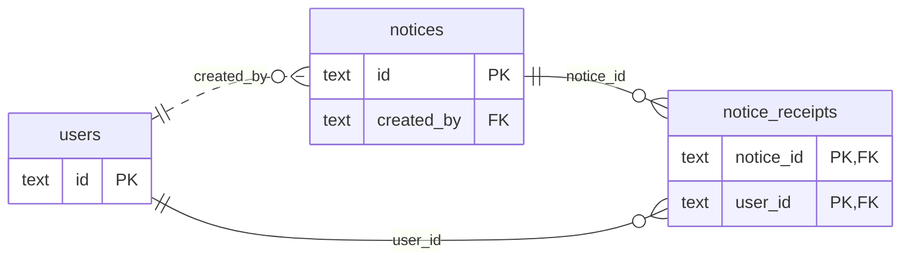
```mermaid
%% Receipts join notices to users, recording the many-to-many delivery relationship.
erDiagram
    %% Receipts join notices to users, recording the many-to-many delivery relationship.
    accTitle: Notices and receipts
    accDescr: Receipts join notices to users, recording the many-to-many delivery relationship.
    direction LR
    notice_receipts {
        text notice_id PK,FK
        text user_id PK,FK
    }
    notices {
        text id PK
        text created_by FK
    }
    users {
        text id PK
    }

    notices ||--o{ notice_receipts : "notice_id"
    users ||--o{ notice_receipts : "user_id"
    users ||..o{ notices : "created_by"
```

Styled Mermaid source

```mermaid
---
config:
  theme: base
  htmlLabels: false
  fontFamily: "Arial, Helvetica, sans-serif"
  er:
    entityPadding: 6
    nodeSpacing: 65
    rankSpacing: 110
    useMaxWidth: false
  themeVariables:
    background: "#FFFFFF"
    mainBkg: "#3522B8"
    rowOdd: "#F7F8FC"
    rowEven: "#F7F8FC"
    nodeBorder: "#5E697A"
    nodeTextColor: "#191821"
    textColor: "#191821"
    lineColor: "#465366"
  themeCSS: |
    & {
      background-color: #FFFFFF;
    }
    .node .label.name text,
    .node .label.name tspan {
      fill: #FFFFFF;
      font-weight: 700;
    }
    .node .label[class*="attribute-"] text {
      fill: #191821;
    }
    .edgeLabel foreignObject .labelBkg {
      background: #FFFFFF !important;
      border-radius: 3px;
      box-shadow: 0 0 0 2px #FFFFFF;
      padding-inline: 3px;
    }
    .edgeLabel foreignObject .edgeLabel,
    .edgeLabel foreignObject p {
      background: transparent !important;
      color: #191821 !important;
    }
    .edgeLabel foreignObject p {
      font-weight: 600;
    }
    .edgeLabel text,
    .edgeLabel tspan {
      fill: #191821 !important;
      stroke: #FFFFFF;
      stroke-width: 3px;
      paint-order: stroke fill;
    }
    .relationshipLine {
      stroke-width: 1px;
    }
    .marker path, .marker circle {
      stroke: #465366 !important;
      stroke-width: 1.4px !important;
    }
    .marker circle {
      fill: #FFFFFF !important;
    }
    marker[id$="zeroOrMoreStart"] path {
      d: path("M36,9 L18,18 L36,27 M18,18 L36,18");
    }
    marker[id$="zeroOrMoreEnd"] path {
      d: path("M21,9 L39,18 L21,27 M21,18 L39,18");
    }
---
erDiagram
    %% Receipts join notices to users, recording the many-to-many delivery relationship.
    accTitle: Notices and receipts
    accDescr: Receipts join notices to users, recording the many-to-many delivery relationship.
    direction LR
    notice_receipts {
        text notice_id PK,FK
        text user_id PK,FK
    }
    notices {
        text id PK
        text created_by FK
    }
    users {
        text id PK
    }

    notices ||--o{ notice_receipts : "notice_id"
    users ||--o{ notice_receipts : "user_id"
    users ||..o{ notices : "created_by"
```

## Templates and revisions

Templates select a current immutable revision. Revisions pin resource profiles and platform artifacts.



Portable Mermaid source

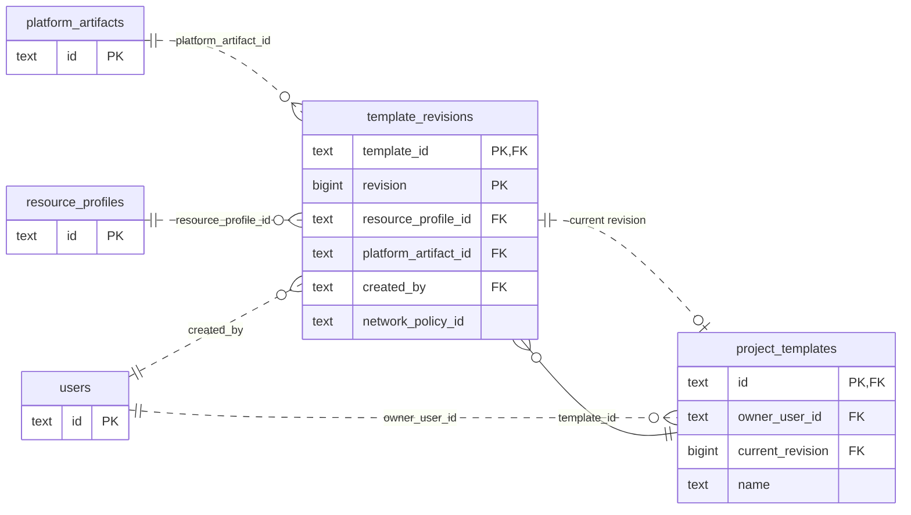
```mermaid
%% Templates select a current immutable revision. Revisions pin resource profiles and platform artifacts.
erDiagram
    %% Templates select a current immutable revision. Revisions pin resource profiles and platform artifacts.
    accTitle: Templates and revisions
    accDescr: Templates select a current immutable revision. Revisions pin resource profiles and platform artifacts.
    direction LR
    platform_artifacts {
        text id PK
    }
    project_templates {
        text id PK,FK
        text owner_user_id FK
        bigint current_revision FK
        text name
    }
    resource_profiles {
        text id PK
    }
    template_revisions {
        text template_id PK,FK
        bigint revision PK
        text resource_profile_id FK
        text platform_artifact_id FK
        text created_by FK
        text network_policy_id
    }
    users {
        text id PK
    }

    platform_artifacts ||..o{ template_revisions : "platform_artifact_id"
    project_templates ||--o{ template_revisions : "template_id"
    resource_profiles ||..o{ template_revisions : "resource_profile_id"
    template_revisions ||..o| project_templates : "current revision"
    users ||..o{ project_templates : "owner_user_id"
    users ||..o{ template_revisions : "created_by"
```

Styled Mermaid source

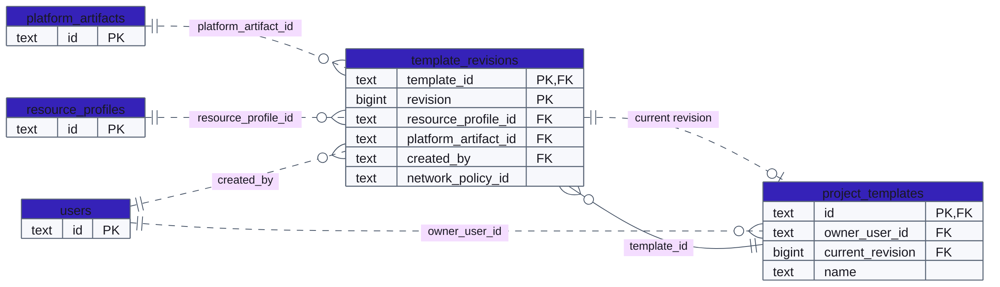
```mermaid
---
config:
  theme: base
  htmlLabels: false
  fontFamily: "Arial, Helvetica, sans-serif"
  er:
    entityPadding: 6
    nodeSpacing: 65
    rankSpacing: 110
    useMaxWidth: false
  themeVariables:
    background: "#FFFFFF"
    mainBkg: "#3522B8"
    rowOdd: "#F7F8FC"
    rowEven: "#F7F8FC"
    nodeBorder: "#5E697A"
    nodeTextColor: "#191821"
    textColor: "#191821"
    lineColor: "#465366"
  themeCSS: |
    & {
      background-color: #FFFFFF;
    }
    .node .label.name text,
    .node .label.name tspan {
      fill: #FFFFFF;
      font-weight: 700;
    }
    .node .label[class*="attribute-"] text {
      fill: #191821;
    }
    .edgeLabel foreignObject .labelBkg {
      background: #FFFFFF !important;
      border-radius: 3px;
      box-shadow: 0 0 0 2px #FFFFFF;
      padding-inline: 3px;
    }
    .edgeLabel foreignObject .edgeLabel,
    .edgeLabel foreignObject p {
      background: transparent !important;
      color: #191821 !important;
    }
    .edgeLabel foreignObject p {
      font-weight: 600;
    }
    .edgeLabel text,
    .edgeLabel tspan {
      fill: #191821 !important;
      stroke: #FFFFFF;
      stroke-width: 3px;
      paint-order: stroke fill;
    }
    .relationshipLine {
      stroke-width: 1px;
    }
    .marker path, .marker circle {
      stroke: #465366 !important;
      stroke-width: 1.4px !important;
    }
    .marker circle {
      fill: #FFFFFF !important;
    }
    marker[id$="zeroOrMoreStart"] path {
      d: path("M36,9 L18,18 L36,27 M18,18 L36,18");
    }
    marker[id$="zeroOrMoreEnd"] path {
      d: path("M21,9 L39,18 L21,27 M21,18 L39,18");
    }
---
erDiagram
    %% Templates select a current immutable revision. Revisions pin resource profiles and platform artifacts.
    accTitle: Templates and revisions
    accDescr: Templates select a current immutable revision. Revisions pin resource profiles and platform artifacts.
    direction LR
    platform_artifacts {
        text id PK
    }
    project_templates {
        text id PK,FK
        text owner_user_id FK
        bigint current_revision FK
        text name
    }
    resource_profiles {
        text id PK
    }
    template_revisions {
        text template_id PK,FK
        bigint revision PK
        text resource_profile_id FK
        text platform_artifact_id FK
        text created_by FK
        text network_policy_id
    }
    users {
        text id PK
    }

    platform_artifacts ||..o{ template_revisions : "platform_artifact_id"
    project_templates ||--o{ template_revisions : "template_id"
    resource_profiles ||..o{ template_revisions : "resource_profile_id"
    template_revisions ||..o| project_templates : "current revision"
    users ||..o{ project_templates : "owner_user_id"
    users ||..o{ template_revisions : "created_by"
```

## Template sharing and requests

Template grants track launch access, recipients and grantors. Requests provide per-user idempotency.



Portable Mermaid source

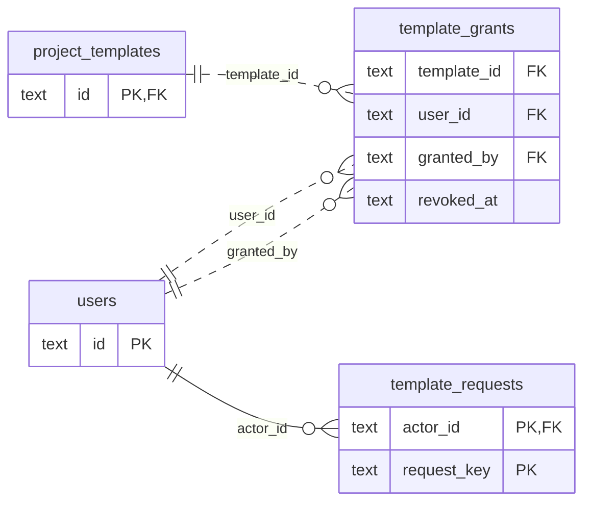
```mermaid
%% Template grants track launch access, recipients and grantors. Requests provide per-user idempotency.
erDiagram
    %% Template grants track launch access, recipients and grantors. Requests provide per-user idempotency.
    accTitle: Template sharing and requests
    accDescr: Template grants track launch access, recipients and grantors. Requests provide per-user idempotency.
    direction LR
    project_templates {
        text id PK,FK
    }
    template_grants {
        text template_id FK
        text user_id FK
        text granted_by FK
        text revoked_at
    }
    template_requests {
        text actor_id PK,FK
        text request_key PK
    }
    users {
        text id PK
    }

    project_templates ||..o{ template_grants : "template_id"
    users ||..o{ template_grants : "user_id"
    users ||..o{ template_grants : "granted_by"
    users ||--o{ template_requests : "actor_id"
```

Styled Mermaid source

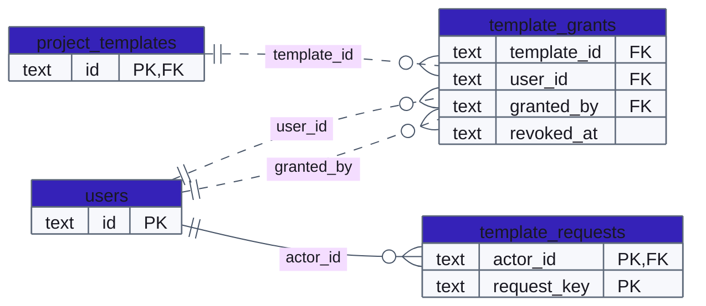
```mermaid
---
config:
  theme: base
  htmlLabels: false
  fontFamily: "Arial, Helvetica, sans-serif"
  er:
    entityPadding: 6
    nodeSpacing: 65
    rankSpacing: 110
    useMaxWidth: false
  themeVariables:
    background: "#FFFFFF"
    mainBkg: "#3522B8"
    rowOdd: "#F7F8FC"
    rowEven: "#F7F8FC"
    nodeBorder: "#5E697A"
    nodeTextColor: "#191821"
    textColor: "#191821"
    lineColor: "#465366"
  themeCSS: |
    & {
      background-color: #FFFFFF;
    }
    .node .label.name text,
    .node .label.name tspan {
      fill: #FFFFFF;
      font-weight: 700;
    }
    .node .label[class*="attribute-"] text {
      fill: #191821;
    }
    .edgeLabel foreignObject .labelBkg {
      background: #FFFFFF !important;
      border-radius: 3px;
      box-shadow: 0 0 0 2px #FFFFFF;
      padding-inline: 3px;
    }
    .edgeLabel foreignObject .edgeLabel,
    .edgeLabel foreignObject p {
      background: transparent !important;
      color: #191821 !important;
    }
    .edgeLabel foreignObject p {
      font-weight: 600;
    }
    .edgeLabel text,
    .edgeLabel tspan {
      fill: #191821 !important;
      stroke: #FFFFFF;
      stroke-width: 3px;
      paint-order: stroke fill;
    }
    .relationshipLine {
      stroke-width: 1px;
    }
    .marker path, .marker circle {
      stroke: #465366 !important;
      stroke-width: 1.4px !important;
    }
    .marker circle {
      fill: #FFFFFF !important;
    }
    marker[id$="zeroOrMoreStart"] path {
      d: path("M36,9 L18,18 L36,27 M18,18 L36,18");
    }
    marker[id$="zeroOrMoreEnd"] path {
      d: path("M21,9 L39,18 L21,27 M21,18 L39,18");
    }
---
erDiagram
    %% Template grants track launch access, recipients and grantors. Requests provide per-user idempotency.
    accTitle: Template sharing and requests
    accDescr: Template grants track launch access, recipients and grantors. Requests provide per-user idempotency.
    direction LR
    project_templates {
        text id PK,FK
    }
    template_grants {
        text template_id FK
        text user_id FK
        text granted_by FK
        text revoked_at
    }
    template_requests {
        text actor_id PK,FK
        text request_key PK
    }
    users {
        text id PK
    }

    project_templates ||..o{ template_grants : "template_id"
    users ||..o{ template_grants : "user_id"
    users ||..o{ template_grants : "granted_by"
    users ||--o{ template_requests : "actor_id"
```

## Resource and network definitions

Resource profiles define compute sizing. Network policies define connectivity rules and provider capabilities.



Portable Mermaid source

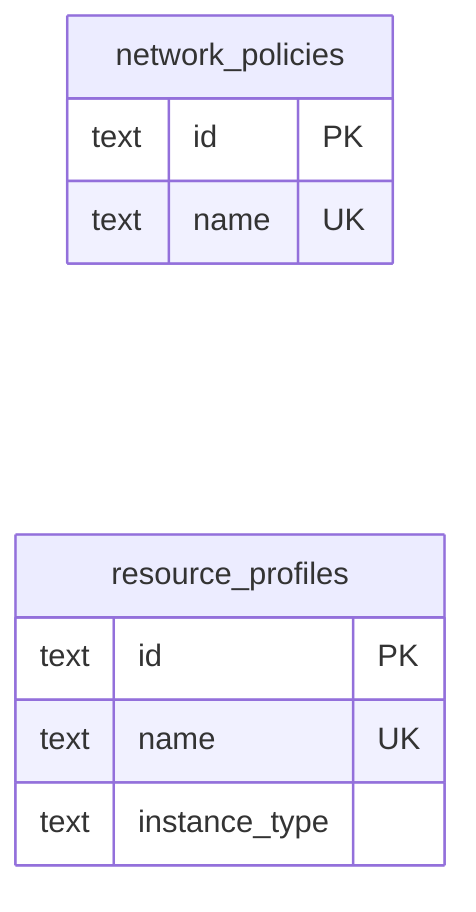
```mermaid
%% Resource profiles define compute sizing. Network policies define connectivity rules and provider capabilities.
erDiagram
    %% Resource profiles define compute sizing. Network policies define connectivity rules and provider capabilities.
    accTitle: Resource and network definitions
    accDescr: Resource profiles define compute sizing. Network policies define connectivity rules and provider capabilities.
    direction LR
    network_policies {
        text id PK
        text name UK
    }
    resource_profiles {
        text id PK
        text name UK
        text instance_type
    }
```

Styled Mermaid source

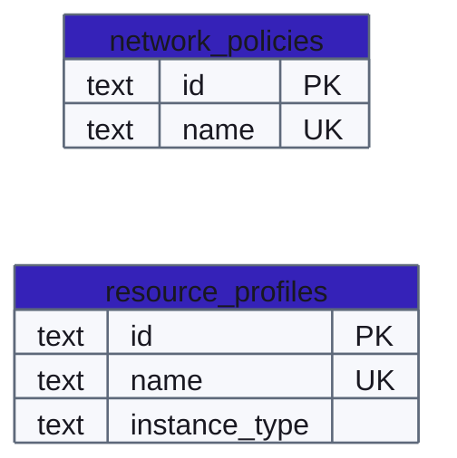
```mermaid
---
config:
  theme: base
  htmlLabels: false
  fontFamily: "Arial, Helvetica, sans-serif"
  er:
    entityPadding: 6
    nodeSpacing: 65
    rankSpacing: 110
    useMaxWidth: false
  themeVariables:
    background: "#FFFFFF"
    mainBkg: "#3522B8"
    rowOdd: "#F7F8FC"
    rowEven: "#F7F8FC"
    nodeBorder: "#5E697A"
    nodeTextColor: "#191821"
    textColor: "#191821"
    lineColor: "#465366"
  themeCSS: |
    & {
      background-color: #FFFFFF;
    }
    .node .label.name text,
    .node .label.name tspan {
      fill: #FFFFFF;
      font-weight: 700;
    }
    .node .label[class*="attribute-"] text {
      fill: #191821;
    }
    .edgeLabel foreignObject .labelBkg {
      background: #FFFFFF !important;
      border-radius: 3px;
      box-shadow: 0 0 0 2px #FFFFFF;
      padding-inline: 3px;
    }
    .edgeLabel foreignObject .edgeLabel,
    .edgeLabel foreignObject p {
      background: transparent !important;
      color: #191821 !important;
    }
    .edgeLabel foreignObject p {
      font-weight: 600;
    }
    .edgeLabel text,
    .edgeLabel tspan {
      fill: #191821 !important;
      stroke: #FFFFFF;
      stroke-width: 3px;
      paint-order: stroke fill;
    }
    .relationshipLine {
      stroke-width: 1px;
    }
    .marker path, .marker circle {
      stroke: #465366 !important;
      stroke-width: 1.4px !important;
    }
    .marker circle {
      fill: #FFFFFF !important;
    }
    marker[id$="zeroOrMoreStart"] path {
      d: path("M36,9 L18,18 L36,27 M18,18 L36,18");
    }
    marker[id$="zeroOrMoreEnd"] path {
      d: path("M21,9 L39,18 L21,27 M21,18 L39,18");
    }
---
erDiagram
    %% Resource profiles define compute sizing. Network policies define connectivity rules and provider capabilities.
    accTitle: Resource and network definitions
    accDescr: Resource profiles define compute sizing. Network policies define connectivity rules and provider capabilities.
    direction LR
    network_policies {
        text id PK
        text name UK
    }
    resource_profiles {
        text id PK
        text name UK
        text instance_type
    }
```

## Infrastructure catalog

Platform imports belong to installation operations. Platform artifacts retain their importer, and each installation has at most one capacity budget.



Portable Mermaid source

```mermaid
%% Platform imports belong to installation operations. Platform artifacts retain their importer, and each installation has at most one capacity budget.
erDiagram
    %% Platform imports belong to installation operations. Platform artifacts retain their importer, and each installation has at most one capacity budget.
    accTitle: Infrastructure catalog
    accDescr: Platform imports belong to installation operations. Platform artifacts retain their importer, and each installation has at most one capacity budget.
    direction LR
    capacity_budgets {
        text installation_id PK,FK
    }
    installations {
        text id PK
    }
    operations {
        text id PK
    }
    platform_artifacts {
        text id PK
        text imported_by FK
        text release_id UK
        text provider_kind
    }
    platform_imports {
        text operation_id PK,FK
        text installation_id FK
    }
    users {
        text id PK
    }

    installations ||..o{ platform_imports : "installation_id"
    installations ||--o| capacity_budgets : "installation_id"
    operations ||--o| platform_imports : "operation_id"
    users ||..o{ platform_artifacts : "imported_by"
```

Styled Mermaid source

```mermaid
---
config:
  theme: base
  htmlLabels: false
  fontFamily: "Arial, Helvetica, sans-serif"
  er:
    entityPadding: 6
    nodeSpacing: 65
    rankSpacing: 110
    useMaxWidth: false
  themeVariables:
    background: "#FFFFFF"
    mainBkg: "#3522B8"
    rowOdd: "#F7F8FC"
    rowEven: "#F7F8FC"
    nodeBorder: "#5E697A"
    nodeTextColor: "#191821"
    textColor: "#191821"
    lineColor: "#465366"
  themeCSS: |
    & {
      background-color: #FFFFFF;
    }
    .node .label.name text,
    .node .label.name tspan {
      fill: #FFFFFF;
      font-weight: 700;
    }
    .node .label[class*="attribute-"] text {
      fill: #191821;
    }
    .edgeLabel foreignObject .labelBkg {
      background: #FFFFFF !important;
      border-radius: 3px;
      box-shadow: 0 0 0 2px #FFFFFF;
      padding-inline: 3px;
    }
    .edgeLabel foreignObject .edgeLabel,
    .edgeLabel foreignObject p {
      background: transparent !important;
      color: #191821 !important;
    }
    .edgeLabel foreignObject p {
      font-weight: 600;
    }
    .edgeLabel text,
    .edgeLabel tspan {
      fill: #191821 !important;
      stroke: #FFFFFF;
      stroke-width: 3px;
      paint-order: stroke fill;
    }
    .relationshipLine {
      stroke-width: 1px;
    }
    .marker path, .marker circle {
      stroke: #465366 !important;
      stroke-width: 1.4px !important;
    }
    .marker circle {
      fill: #FFFFFF !important;
    }
    marker[id$="zeroOrMoreStart"] path {
      d: path("M36,9 L18,18 L36,27 M18,18 L36,18");
    }
    marker[id$="zeroOrMoreEnd"] path {
      d: path("M21,9 L39,18 L21,27 M21,18 L39,18");
    }
---
erDiagram
    %% Platform imports belong to installation operations. Platform artifacts retain their importer, and each installation has at most one capacity budget.
    accTitle: Infrastructure catalog
    accDescr: Platform imports belong to installation operations. Platform artifacts retain their importer, and each installation has at most one capacity budget.
    direction LR
    capacity_budgets {
        text installation_id PK,FK
    }
    installations {
        text id PK
    }
    operations {
        text id PK
    }
    platform_artifacts {
        text id PK
        text imported_by FK
        text release_id UK
        text provider_kind
    }
    platform_imports {
        text operation_id PK,FK
        text installation_id FK
    }
    users {
        text id PK
    }

    installations ||..o{ platform_imports : "installation_id"
    installations ||--o| capacity_budgets : "installation_id"
    operations ||--o| platform_imports : "operation_id"
    users ||..o{ platform_artifacts : "imported_by"
```

## Workspaces and capacity

Workspace ownership and platform selection connect to reservations, provider resources and activity observations.



Portable Mermaid source

```mermaid
%% Workspace ownership and platform selection connect to reservations, provider resources and activity observations.
erDiagram
    %% Workspace ownership and platform selection connect to reservations, provider resources and activity observations.
    accTitle: Workspaces and capacity
    accDescr: Workspace ownership and platform selection connect to reservations, provider resources and activity observations.
    direction LR
    activity_observations {
        text workspace_id PK,FK
        bigint generation PK
        text source PK
    }
    installations {
        text id PK
    }
    platform_artifacts {
        text id PK
    }
    provider_resources {
        text workspace_id PK,FK
        text provider_resource_id PK
    }
    reservations {
        text workspace_id PK,FK
    }
    users {
        text id PK
    }
    workspaces {
        text id PK
        text installation_id FK
        text owner_user_id FK
        text platform_artifact_id FK
        text name
        text template_id
        bigint template_revision
        text instance_type
        bigint generation
        text desired_state
        text observed_state
    }

    installations ||..o{ workspaces : "installation_id"
    platform_artifacts ||..o{ workspaces : "platform_artifact_id"
    users ||..o{ workspaces : "owner_user_id"
    workspaces ||--o| reservations : "workspace_id"
    workspaces ||--o{ provider_resources : "workspace_id"
    workspaces ||--o{ activity_observations : "workspace_id"
```

Styled Mermaid source

```mermaid
---
config:
  theme: base
  htmlLabels: false
  fontFamily: "Arial, Helvetica, sans-serif"
  er:
    entityPadding: 6
    nodeSpacing: 65
    rankSpacing: 110
    useMaxWidth: false
  themeVariables:
    background: "#FFFFFF"
    mainBkg: "#3522B8"
    rowOdd: "#F7F8FC"
    rowEven: "#F7F8FC"
    nodeBorder: "#5E697A"
    nodeTextColor: "#191821"
    textColor: "#191821"
    lineColor: "#465366"
  themeCSS: |
    & {
      background-color: #FFFFFF;
    }
    .node .label.name text,
    .node .label.name tspan {
      fill: #FFFFFF;
      font-weight: 700;
    }
    .node .label[class*="attribute-"] text {
      fill: #191821;
    }
    .edgeLabel foreignObject .labelBkg {
      background: #FFFFFF !important;
      border-radius: 3px;
      box-shadow: 0 0 0 2px #FFFFFF;
      padding-inline: 3px;
    }
    .edgeLabel foreignObject .edgeLabel,
    .edgeLabel foreignObject p {
      background: transparent !important;
      color: #191821 !important;
    }
    .edgeLabel foreignObject p {
      font-weight: 600;
    }
    .edgeLabel text,
    .edgeLabel tspan {
      fill: #191821 !important;
      stroke: #FFFFFF;
      stroke-width: 3px;
      paint-order: stroke fill;
    }
    .relationshipLine {
      stroke-width: 1px;
    }
    .marker path, .marker circle {
      stroke: #465366 !important;
      stroke-width: 1.4px !important;
    }
    .marker circle {
      fill: #FFFFFF !important;
    }
    marker[id$="zeroOrMoreStart"] path {
      d: path("M36,9 L18,18 L36,27 M18,18 L36,18");
    }
    marker[id$="zeroOrMoreEnd"] path {
      d: path("M21,9 L39,18 L21,27 M21,18 L39,18");
    }
---
erDiagram
    %% Workspace ownership and platform selection connect to reservations, provider resources and activity observations.
    accTitle: Workspaces and capacity
    accDescr: Workspace ownership and platform selection connect to reservations, provider resources and activity observations.
    direction LR
    activity_observations {
        text workspace_id PK,FK
        bigint generation PK
        text source PK
    }
    installations {
        text id PK
    }
    platform_artifacts {
        text id PK
    }
    provider_resources {
        text workspace_id PK,FK
        text provider_resource_id PK
    }
    reservations {
        text workspace_id PK,FK
    }
    users {
        text id PK
    }
    workspaces {
        text id PK
        text installation_id FK
        text owner_user_id FK
        text platform_artifact_id FK
        text name
        text template_id
        bigint template_revision
        text instance_type
        bigint generation
        text desired_state
        text observed_state
    }

    installations ||..o{ workspaces : "installation_id"
    platform_artifacts ||..o{ workspaces : "platform_artifact_id"
    users ||..o{ workspaces : "owner_user_id"
    workspaces ||--o| reservations : "workspace_id"
    workspaces ||--o{ provider_resources : "workspace_id"
    workspaces ||--o{ activity_observations : "workspace_id"
```

## Operation journal

Operations own ordered steps, events and an optional guest dispatch.



Portable Mermaid source

```mermaid
%% Operations own ordered steps, events and an optional guest dispatch.
erDiagram
    %% Operations own ordered steps, events and an optional guest dispatch.
    accTitle: Operation journal
    accDescr: Operations own ordered steps, events and an optional guest dispatch.
    direction LR
    guest_dispatches {
        text operation_id PK,FK
        text activation_status
    }
    operation_events {
        text operation_id PK,FK
        bigint event_id PK
    }
    operation_steps {
        text operation_id PK,FK
        integer step_index PK
        text step_key
    }
    operations {
        text id PK
        text workspace_id
        text requested_by
        text request_key
        text type
        text status
    }

    operations ||--o{ operation_steps : "operation_id"
    operations ||--o{ operation_events : "operation_id"
    operations ||--o| guest_dispatches : "operation_id"
```

Styled Mermaid source

```mermaid
---
config:
  theme: base
  htmlLabels: false
  fontFamily: "Arial, Helvetica, sans-serif"
  er:
    entityPadding: 6
    nodeSpacing: 65
    rankSpacing: 110
    useMaxWidth: false
  themeVariables:
    background: "#FFFFFF"
    mainBkg: "#3522B8"
    rowOdd: "#F7F8FC"
    rowEven: "#F7F8FC"
    nodeBorder: "#5E697A"
    nodeTextColor: "#191821"
    textColor: "#191821"
    lineColor: "#465366"
  themeCSS: |
    & {
      background-color: #FFFFFF;
    }
    .node .label.name text,
    .node .label.name tspan {
      fill: #FFFFFF;
      font-weight: 700;
    }
    .node .label[class*="attribute-"] text {
      fill: #191821;
    }
    .edgeLabel foreignObject .labelBkg {
      background: #FFFFFF !important;
      border-radius: 3px;
      box-shadow: 0 0 0 2px #FFFFFF;
      padding-inline: 3px;
    }
    .edgeLabel foreignObject .edgeLabel,
    .edgeLabel foreignObject p {
      background: transparent !important;
      color: #191821 !important;
    }
    .edgeLabel foreignObject p {
      font-weight: 600;
    }
    .edgeLabel text,
    .edgeLabel tspan {
      fill: #191821 !important;
      stroke: #FFFFFF;
      stroke-width: 3px;
      paint-order: stroke fill;
    }
    .relationshipLine {
      stroke-width: 1px;
    }
    .marker path, .marker circle {
      stroke: #465366 !important;
      stroke-width: 1.4px !important;
    }
    .marker circle {
      fill: #FFFFFF !important;
    }
    marker[id$="zeroOrMoreStart"] path {
      d: path("M36,9 L18,18 L36,27 M18,18 L36,18");
    }
    marker[id$="zeroOrMoreEnd"] path {
      d: path("M21,9 L39,18 L21,27 M21,18 L39,18");
    }
---
erDiagram
    %% Operations own ordered steps, events and an optional guest dispatch.
    accTitle: Operation journal
    accDescr: Operations own ordered steps, events and an optional guest dispatch.
    direction LR
    guest_dispatches {
        text operation_id PK,FK
        text activation_status
    }
    operation_events {
        text operation_id PK,FK
        bigint event_id PK
    }
    operation_steps {
        text operation_id PK,FK
        integer step_index PK
        text step_key
    }
    operations {
        text id PK
        text workspace_id
        text requested_by
        text request_key
        text type
        text status
    }

    operations ||--o{ operation_steps : "operation_id"
    operations ||--o{ operation_events : "operation_id"
    operations ||--o| guest_dispatches : "operation_id"
```

## Guest registration and enrollment

Guest registrations are keyed by workspace and generation. Enrollment grants reference that composite identity and their operation.



Portable Mermaid source

```mermaid
%% Guest registrations are keyed by workspace and generation. Enrollment grants reference that composite identity and their operation.
erDiagram
    %% Guest registrations are keyed by workspace and generation. Enrollment grants reference that composite identity and their operation.
    accTitle: Guest registration and enrollment
    accDescr: Guest registrations are keyed by workspace and generation. Enrollment grants reference that composite identity and their operation.
    direction LR
    enrollment_grants {
        text id PK
        text workspace_id FK
        bigint generation FK
        text operation_id FK
    }
    guest_registrations {
        text workspace_id PK,FK
        bigint generation PK
        text state
    }
    operations {
        text id PK
    }
    workspaces {
        text id PK
    }

    workspaces ||--o{ guest_registrations : "workspace_id"
    operations ||..o{ enrollment_grants : "operation_id"
    guest_registrations ||..o{ enrollment_grants : "workspace_id + generation"
```

Styled Mermaid source

```mermaid
---
config:
  theme: base
  htmlLabels: false
  fontFamily: "Arial, Helvetica, sans-serif"
  er:
    entityPadding: 6
    nodeSpacing: 65
    rankSpacing: 110
    useMaxWidth: false
  themeVariables:
    background: "#FFFFFF"
    mainBkg: "#3522B8"
    rowOdd: "#F7F8FC"
    rowEven: "#F7F8FC"
    nodeBorder: "#5E697A"
    nodeTextColor: "#191821"
    textColor: "#191821"
    lineColor: "#465366"
  themeCSS: |
    & {
      background-color: #FFFFFF;
    }
    .node .label.name text,
    .node .label.name tspan {
      fill: #FFFFFF;
      font-weight: 700;
    }
    .node .label[class*="attribute-"] text {
      fill: #191821;
    }
    .edgeLabel foreignObject .labelBkg {
      background: #FFFFFF !important;
      border-radius: 3px;
      box-shadow: 0 0 0 2px #FFFFFF;
      padding-inline: 3px;
    }
    .edgeLabel foreignObject .edgeLabel,
    .edgeLabel foreignObject p {
      background: transparent !important;
      color: #191821 !important;
    }
    .edgeLabel foreignObject p {
      font-weight: 600;
    }
    .edgeLabel text,
    .edgeLabel tspan {
      fill: #191821 !important;
      stroke: #FFFFFF;
      stroke-width: 3px;
      paint-order: stroke fill;
    }
    .relationshipLine {
      stroke-width: 1px;
    }
    .marker path, .marker circle {
      stroke: #465366 !important;
      stroke-width: 1.4px !important;
    }
    .marker circle {
      fill: #FFFFFF !important;
    }
    marker[id$="zeroOrMoreStart"] path {
      d: path("M36,9 L18,18 L36,27 M18,18 L36,18");
    }
    marker[id$="zeroOrMoreEnd"] path {
      d: path("M21,9 L39,18 L21,27 M21,18 L39,18");
    }
---
erDiagram
    %% Guest registrations are keyed by workspace and generation. Enrollment grants reference that composite identity and their operation.
    accTitle: Guest registration and enrollment
    accDescr: Guest registrations are keyed by workspace and generation. Enrollment grants reference that composite identity and their operation.
    direction LR
    enrollment_grants {
        text id PK
        text workspace_id FK
        bigint generation FK
        text operation_id FK
    }
    guest_registrations {
        text workspace_id PK,FK
        bigint generation PK
        text state
    }
    operations {
        text id PK
    }
    workspaces {
        text id PK
    }

    workspaces ||--o{ guest_registrations : "workspace_id"
    operations ||..o{ enrollment_grants : "operation_id"
    guest_registrations ||..o{ enrollment_grants : "workspace_id + generation"
```

## EC2 launch enrollment

An operation can have one launch enrollment, which can issue multiple launch challenges.



Portable Mermaid source

```mermaid
%% An operation can have one launch enrollment, which can issue multiple launch challenges.
erDiagram
    %% An operation can have one launch enrollment, which can issue multiple launch challenges.
    accTitle: EC2 launch enrollment
    accDescr: An operation can have one launch enrollment, which can issue multiple launch challenges.
    direction LR
    ec2_launch_challenges {
        text nonce PK
        text operation_id FK
    }
    ec2_launch_enrollment {
        text operation_id PK,FK
    }
    operations {
        text id PK
    }

    operations ||--o| ec2_launch_enrollment : "operation_id"
    ec2_launch_enrollment ||..o{ ec2_launch_challenges : "operation_id"
```

Styled Mermaid source

```mermaid
---
config:
  theme: base
  htmlLabels: false
  fontFamily: "Arial, Helvetica, sans-serif"
  er:
    entityPadding: 6
    nodeSpacing: 65
    rankSpacing: 110
    useMaxWidth: false
  themeVariables:
    background: "#FFFFFF"
    mainBkg: "#3522B8"
    rowOdd: "#F7F8FC"
    rowEven: "#F7F8FC"
    nodeBorder: "#5E697A"
    nodeTextColor: "#191821"
    textColor: "#191821"
    lineColor: "#465366"
  themeCSS: |
    & {
      background-color: #FFFFFF;
    }
    .node .label.name text,
    .node .label.name tspan {
      fill: #FFFFFF;
      font-weight: 700;
    }
    .node .label[class*="attribute-"] text {
      fill: #191821;
    }
    .edgeLabel foreignObject .labelBkg {
      background: #FFFFFF !important;
      border-radius: 3px;
      box-shadow: 0 0 0 2px #FFFFFF;
      padding-inline: 3px;
    }
    .edgeLabel foreignObject .edgeLabel,
    .edgeLabel foreignObject p {
      background: transparent !important;
      color: #191821 !important;
    }
    .edgeLabel foreignObject p {
      font-weight: 600;
    }
    .edgeLabel text,
    .edgeLabel tspan {
      fill: #191821 !important;
      stroke: #FFFFFF;
      stroke-width: 3px;
      paint-order: stroke fill;
    }
    .relationshipLine {
      stroke-width: 1px;
    }
    .marker path, .marker circle {
      stroke: #465366 !important;
      stroke-width: 1.4px !important;
    }
    .marker circle {
      fill: #FFFFFF !important;
    }
    marker[id$="zeroOrMoreStart"] path {
      d: path("M36,9 L18,18 L36,27 M18,18 L36,18");
    }
    marker[id$="zeroOrMoreEnd"] path {
      d: path("M21,9 L39,18 L21,27 M21,18 L39,18");
    }
---
erDiagram
    %% An operation can have one launch enrollment, which can issue multiple launch challenges.
    accTitle: EC2 launch enrollment
    accDescr: An operation can have one launch enrollment, which can issue multiple launch challenges.
    direction LR
    ec2_launch_challenges {
        text nonce PK
        text operation_id FK
    }
    ec2_launch_enrollment {
        text operation_id PK,FK
    }
    operations {
        text id PK
    }

    operations ||--o| ec2_launch_enrollment : "operation_id"
    ec2_launch_enrollment ||..o{ ec2_launch_challenges : "operation_id"
```

## Maintenance campaigns

Campaign targets join maintenance campaigns to workspaces, with an optional execution operation per target.



Portable Mermaid source

```mermaid
%% Campaign targets join maintenance campaigns to workspaces, with an optional execution operation per target.
erDiagram
    %% Campaign targets join maintenance campaigns to workspaces, with an optional execution operation per target.
    accTitle: Maintenance campaigns
    accDescr: Campaign targets join maintenance campaigns to workspaces, with an optional execution operation per target.
    direction TB
    installations {
        text id PK
    }
    maintenance_campaigns {
        text operation_id PK,FK
        text installation_id FK
        text created_by FK
    }
    maintenance_targets {
        text campaign_id PK,FK
        text workspace_id PK,FK
        text operation_id FK,UK
    }
    operations {
        text id PK
    }
    users {
        text id PK
    }
    workspaces {
        text id PK
    }

    users ||..o{ maintenance_campaigns : "created_by"
    operations ||--o| maintenance_campaigns : "operation_id"
    installations ||..o{ maintenance_campaigns : "installation_id"
    workspaces ||--o{ maintenance_targets : "workspace_id"
    operations |o..o| maintenance_targets : "operation_id"
    maintenance_campaigns ||--o{ maintenance_targets : "campaign_id"
```

Styled Mermaid source

```mermaid
---
config:
  theme: base
  htmlLabels: false
  fontFamily: "Arial, Helvetica, sans-serif"
  er:
    entityPadding: 6
    nodeSpacing: 65
    rankSpacing: 110
    useMaxWidth: false
  themeVariables:
    background: "#FFFFFF"
    mainBkg: "#3522B8"
    rowOdd: "#F7F8FC"
    rowEven: "#F7F8FC"
    nodeBorder: "#5E697A"
    nodeTextColor: "#191821"
    textColor: "#191821"
    lineColor: "#465366"
  themeCSS: |
    & {
      background-color: #FFFFFF;
    }
    .node .label.name text,
    .node .label.name tspan {
      fill: #FFFFFF;
      font-weight: 700;
    }
    .node .label[class*="attribute-"] text {
      fill: #191821;
    }
    .edgeLabel foreignObject .labelBkg {
      background: #FFFFFF !important;
      border-radius: 3px;
      box-shadow: 0 0 0 2px #FFFFFF;
      padding-inline: 3px;
    }
    .edgeLabel foreignObject .edgeLabel,
    .edgeLabel foreignObject p {
      background: transparent !important;
      color: #191821 !important;
    }
    .edgeLabel foreignObject p {
      font-weight: 600;
    }
    .edgeLabel text,
    .edgeLabel tspan {
      fill: #191821 !important;
      stroke: #FFFFFF;
      stroke-width: 3px;
      paint-order: stroke fill;
    }
    .relationshipLine {
      stroke-width: 1px;
    }
    .marker path, .marker circle {
      stroke: #465366 !important;
      stroke-width: 1.4px !important;
    }
    .marker circle {
      fill: #FFFFFF !important;
    }
    marker[id$="zeroOrMoreStart"] path {
      d: path("M36,9 L18,18 L36,27 M18,18 L36,18");
    }
    marker[id$="zeroOrMoreEnd"] path {
      d: path("M21,9 L39,18 L21,27 M21,18 L39,18");
    }
---
erDiagram
    %% Campaign targets join maintenance campaigns to workspaces, with an optional execution operation per target.
    accTitle: Maintenance campaigns
    accDescr: Campaign targets join maintenance campaigns to workspaces, with an optional execution operation per target.
    direction TB
    installations {
        text id PK
    }
    maintenance_campaigns {
        text operation_id PK,FK
        text installation_id FK
        text created_by FK
    }
    maintenance_targets {
        text campaign_id PK,FK
        text workspace_id PK,FK
        text operation_id FK,UK
    }
    operations {
        text id PK
    }
    users {
        text id PK
    }
    workspaces {
        text id PK
    }

    users ||..o{ maintenance_campaigns : "created_by"
    operations ||--o| maintenance_campaigns : "operation_id"
    installations ||..o{ maintenance_campaigns : "installation_id"
    workspaces ||--o{ maintenance_targets : "workspace_id"
    operations |o..o| maintenance_targets : "operation_id"
    maintenance_campaigns ||--o{ maintenance_targets : "campaign_id"
```

## Audit and operational conditions

Audit events retain typed actor and resource identifiers. Operational conditions track the current severity of named conditions.



Portable Mermaid source

```mermaid
%% Audit events retain typed actor and resource identifiers. Operational conditions track the current severity of named conditions.
erDiagram
    %% Audit events retain typed actor and resource identifiers. Operational conditions track the current severity of named conditions.
    accTitle: Audit and operational conditions
    accDescr: Audit events retain typed actor and resource identifiers. Operational conditions track the current severity of named conditions.
    direction LR
    audit_events {
        bigserial id PK
        text actor_type
        text actor_id
        text resource_type
        text resource_id
    }
    operational_conditions {
        text condition_key PK
        text severity
    }
```

Styled Mermaid source

```mermaid
---
config:
  theme: base
  htmlLabels: false
  fontFamily: "Arial, Helvetica, sans-serif"
  er:
    entityPadding: 6
    nodeSpacing: 65
    rankSpacing: 110
    useMaxWidth: false
  themeVariables:
    background: "#FFFFFF"
    mainBkg: "#3522B8"
    rowOdd: "#F7F8FC"
    rowEven: "#F7F8FC"
    nodeBorder: "#5E697A"
    nodeTextColor: "#191821"
    textColor: "#191821"
    lineColor: "#465366"
  themeCSS: |
    & {
      background-color: #FFFFFF;
    }
    .node .label.name text,
    .node .label.name tspan {
      fill: #FFFFFF;
      font-weight: 700;
    }
    .node .label[class*="attribute-"] text {
      fill: #191821;
    }
    .edgeLabel foreignObject .labelBkg {
      background: #FFFFFF !important;
      border-radius: 3px;
      box-shadow: 0 0 0 2px #FFFFFF;
      padding-inline: 3px;
    }
    .edgeLabel foreignObject .edgeLabel,
    .edgeLabel foreignObject p {
      background: transparent !important;
      color: #191821 !important;
    }
    .edgeLabel foreignObject p {
      font-weight: 600;
    }
    .edgeLabel text,
    .edgeLabel tspan {
      fill: #191821 !important;
      stroke: #FFFFFF;
      stroke-width: 3px;
      paint-order: stroke fill;
    }
    .relationshipLine {
      stroke-width: 1px;
    }
    .marker path, .marker circle {
      stroke: #465366 !important;
      stroke-width: 1.4px !important;
    }
    .marker circle {
      fill: #FFFFFF !important;
    }
    marker[id$="zeroOrMoreStart"] path {
      d: path("M36,9 L18,18 L36,27 M18,18 L36,18");
    }
    marker[id$="zeroOrMoreEnd"] path {
      d: path("M21,9 L39,18 L21,27 M21,18 L39,18");
    }
---
erDiagram
    %% Audit events retain typed actor and resource identifiers. Operational conditions track the current severity of named conditions.
    accTitle: Audit and operational conditions
    accDescr: Audit events retain typed actor and resource identifiers. Operational conditions track the current severity of named conditions.
    direction LR
    audit_events {
        bigserial id PK
        text actor_type
        text actor_id
        text resource_type
        text resource_id
    }
    operational_conditions {
        text condition_key PK
        text severity
    }
```

## Backup and recovery

Backup records, restore reviews and migration preflights track their operations. Preflights also reference the installation.



Portable Mermaid source

```mermaid
%% Backup records, restore reviews and migration preflights track their operations. Preflights also reference the installation.
erDiagram
    %% Backup records, restore reviews and migration preflights track their operations. Preflights also reference the installation.
    accTitle: Backup and recovery
    accDescr: Backup records, restore reviews and migration preflights track their operations. Preflights also reference the installation.
    direction TB
    backup_records {
        text id PK
        text operation_id FK,UK
        text state
    }
    installations {
        text id PK
    }
    migration_preflights {
        text operation_id PK,FK
        text installation_id FK
    }
    operations {
        text id PK
    }
    recovery_reviews {
        text id PK
        text restore_operation_id FK,UK
        text state
    }

    operations ||..o| backup_records : "operation_id"
    operations ||--o| migration_preflights : "operation_id"
    installations ||..o{ migration_preflights : "installation_id"
    operations ||..o| recovery_reviews : "restore_operation_id"
```

Styled Mermaid source

```mermaid
---
config:
  theme: base
  htmlLabels: false
  fontFamily: "Arial, Helvetica, sans-serif"
  er:
    entityPadding: 6
    nodeSpacing: 65
    rankSpacing: 110
    useMaxWidth: false
  themeVariables:
    background: "#FFFFFF"
    mainBkg: "#3522B8"
    rowOdd: "#F7F8FC"
    rowEven: "#F7F8FC"
    nodeBorder: "#5E697A"
    nodeTextColor: "#191821"
    textColor: "#191821"
    lineColor: "#465366"
  themeCSS: |
    & {
      background-color: #FFFFFF;
    }
    .node .label.name text,
    .node .label.name tspan {
      fill: #FFFFFF;
      font-weight: 700;
    }
    .node .label[class*="attribute-"] text {
      fill: #191821;
    }
    .edgeLabel foreignObject .labelBkg {
      background: #FFFFFF !important;
      border-radius: 3px;
      box-shadow: 0 0 0 2px #FFFFFF;
      padding-inline: 3px;
    }
    .edgeLabel foreignObject .edgeLabel,
    .edgeLabel foreignObject p {
      background: transparent !important;
      color: #191821 !important;
    }
    .edgeLabel foreignObject p {
      font-weight: 600;
    }
    .edgeLabel text,
    .edgeLabel tspan {
      fill: #191821 !important;
      stroke: #FFFFFF;
      stroke-width: 3px;
      paint-order: stroke fill;
    }
    .relationshipLine {
      stroke-width: 1px;
    }
    .marker path, .marker circle {
      stroke: #465366 !important;
      stroke-width: 1.4px !important;
    }
    .marker circle {
      fill: #FFFFFF !important;
    }
    marker[id$="zeroOrMoreStart"] path {
      d: path("M36,9 L18,18 L36,27 M18,18 L36,18");
    }
    marker[id$="zeroOrMoreEnd"] path {
      d: path("M21,9 L39,18 L21,27 M21,18 L39,18");
    }
---
erDiagram
    %% Backup records, restore reviews and migration preflights track their operations. Preflights also reference the installation.
    accTitle: Backup and recovery
    accDescr: Backup records, restore reviews and migration preflights track their operations. Preflights also reference the installation.
    direction TB
    backup_records {
        text id PK
        text operation_id FK,UK
        text state
    }
    installations {
        text id PK
    }
    migration_preflights {
        text operation_id PK,FK
        text installation_id FK
    }
    operations {
        text id PK
    }
    recovery_reviews {
        text id PK
        text restore_operation_id FK,UK
        text state
    }

    operations ||..o| backup_records : "operation_id"
    operations ||--o| migration_preflights : "operation_id"
    installations ||..o{ migration_preflights : "installation_id"
    operations ||..o| recovery_reviews : "restore_operation_id"
```

## Application-managed references

| Field | Meaning |
| --- | --- |
| `workspaces.(template_id, template_revision)` | Pins the launch revision. The workspace also stores resolved resource sizing and a network-policy snapshot. |
| `template_revisions.network_policy_id` | Optionally selects a network policy. |
| `operations.workspace_id` | Associates workspace-scoped operations with a workspace. Operations such as installation setup can omit it. |
| `origin_grants` user, session and workspace fields | Bind a browser origin grant to a session and workspace generation. An administrator connection also carries a resource grant ID. |
| `secret_values.(scope_type, scope_id)` | Identifies a user, project template or organization (installation). Workspace lookup checks the owner, then the template when permitted, then the organization. |
| `audit_events` actor and resource fields | Record typed identifiers for audit history. |

A template's `(id, current_revision)` is a deferred foreign key to `template_revisions.(template_id, revision)`. Template grants have no primary key. A partial unique index allows at most one unrevoked grant per template and user while retaining revoked grant history. Migration tracking is managed by Goose.
